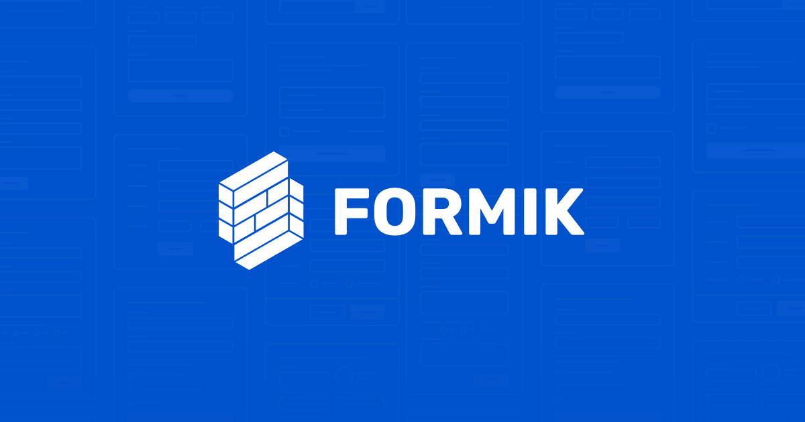

# Sistema de Login (Frontend)

## 📖  Descrição

Este é um projeto de um sistema que consome a api do star wars para compra de veículos.

 

## 🛠️ Funcionalidades

- Consome a API do star wars e exibe os veículos com as informações recebidas.
- Ao selecionar um veículo, o usuário é enviado para a tela de checkout para preenchimento dos formulários.
- Faz a validação do email, cpf/cnpj e dados do cartão de crédito.
- Ao preencher o CEP, o sistema faz uma requisição a api  [VIACEP](https://viacep.com.br/) para preenchimento dos demais dados.
- Exibe um toast de sucesso caso todos os dados estejam corretos.
- Todos os dados serão mockados.

 

## 📡 Tecnologias utilizadas 
 

 

    

## 📖 Aprendizado

- Utilização do Styled-Components e do Material UI para estilização da página.
- Utilização do Router-DOM para trabalhar com as rotas.
- Utilização do Axios para facilitar as requisições a api do star-wars e viacep.
- Utilização do Mobx para salvar os dados do usuário, informado no formulário.
- Utilização do YUP para fazer todas as verificações dos inputs.
- Utilização do Formik para auxiliar a contrução dos formulários, trabalhando junto com o YUP.

## 🔎 Status do Projeto
- Projeto rodando em: [Star Wars Vehicles - Leonardo Cunha](https://star-wars-vehicles.leonardocunha.dev.br/)